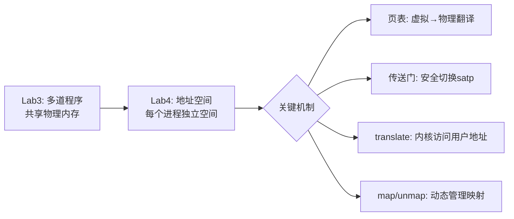

# Lab4：地址空间 —— 让每个程序拥有"自己的世界"

## 你会学到什么

完成本实验后，你将理解：
- 为什么让所有程序共享物理内存是危险的，地址空间如何解决这个问题
- 虚拟地址和物理地址的关系，页表是怎么做翻译的
- SV39 三级页表为什么比一级大表省几万倍空间
- 异界传送门（Portal）如何解决切换地址空间时代码还能继续跑的问题
- 系统调用中，内核怎么安全地读写用户的虚拟地址
- 为什么内核栈上不能放大数组（栈溢出陷阱）

> 遇到不熟悉的术语？查看[术语表](../glossary.md)

## 前置要求

- 已完成 Lab3（理解多道程序、调度循环、时钟中断）
- 能在终端执行 `cargo run` 并看到输出

---

## 第一节：为什么需要地址空间？

回顾 Lab3：多个程序可以"同时"运行了，但它们**直接共享物理内存**。这有两个严重问题：

**问题1：没有隔离**

程序 A 可以随意读写程序 B 的内存，甚至篡改内核的数据。就像一栋没有墙的办公楼——每个人的文件都摊在大厅里，谁都能拿走别人的东西。

**问题2：地址冲突**

每个程序在编译时就要确定自己被放在哪个物理地址，非常不灵活。就像每个住户搬进来之前，必须先知道自己住几号房——如果两个人都想住 301，就没法办了。

**Lab4 的解决方案：虚拟内存**

给每个程序一个"假装自己独占整个内存"的幻觉。实际上，操作系统和硬件在背后偷偷做地址翻译：

```
程序以为的地址（虚拟地址）  →  MMU翻译  →  真实的地址（物理地址）
```

就像每个住户拿到的都是"我家在1楼"的门牌号，但物理上可能一个在3楼一个在7楼。每个人看到的"1楼"不一样，但互不干扰。

---

## 第二节：页表 —— 虚拟地址到物理地址的翻译表

### 什么是页？

内存管理的最小单位是**页（Page）**，大小固定为 **4KB**（4096 字节）。

不管你要 1 字节还是 4000 字节，操作系统都会分配整页（4KB）给你。就像仓库里最小的储物柜是 1 立方米的——哪怕你只放一双鞋，也要占一整个柜子。

### 什么是页表？

页表就是一张"翻译表"，告诉 CPU：

```
虚拟页号 17  →  物理页号 42
虚拟页号 18  →  物理页号 99
虚拟页号 19  →  没有映射（访问会触发异常）
```

每个进程有自己的页表，所以同一个虚拟地址在不同进程里指向不同的物理地址。

### SV39 三级页表 —— 为什么要三级？

RISC-V 的 SV39 模式用 39 位虚拟地址，理论上有 2^27 = 1.34 亿个虚拟页。

**如果用一级页表（一个大数组）：**

```
页表大小 = 2^27 × 8字节 = 1GB
```

每个进程 1GB 的页表？太浪费了！一个程序可能只用了几百个页，但你要为所有 1.34 亿个页都留位置。

**三级页表（树结构）的妙处：**

```
        根页表（512项）
       /     |      \
  二级页表  二级页表  ...（大多数不创建）
  /  |  \
三级  三级  ...（只有用到的才创建）
```

只有程序实际使用的地址范围才会创建对应的页表节点，空的分支不占空间。一个典型程序只需要约 5 个页表页（~20KB），比 1GB 省了 5 万倍。

**核心思想**：数组不能有"空洞"（即使没数据也要占位），树可以跳过空的分支。

### 地址翻译过程

```
虚拟地址（39位）:
┌─────────┬─────────┬─────────┬──────────┐
│ VPN[2]  │ VPN[1]  │ VPN[0]  │  offset  │
│ 9位     │ 9位     │ 9位     │  12位    │
└────┬────┴────┬────┴────┬────┴──────────┘
     │         │         │
     ↓         ↓         ↓
  根页表  →  二级页表  →  三级页表  →  物理页号 + offset = 物理地址
```

查三次表才能得到物理地址，看起来很慢？实际上 CPU 内部有一个叫 **TLB** 的缓存，命中率超过 95%，所以绝大多数时候三级查找是零代价的。

### satp 寄存器 —— 告诉 CPU 用哪个页表

```
satp 寄存器 = [模式(SV39)] + [根页表的物理页号]
```

切换进程时，操作系统把 satp 换成新进程的根页表地址，CPU 就开始用新的翻译规则了。

### 权限标志 —— 控制谁能访问

每个页表项都有权限位：

| 标志 | 含义 | 说明 |
|------|------|------|
| V | Valid（有效） | 这个页表项是否生效 |
| R | Read（可读） | 能否读取 |
| W | Write（可写） | 能否写入 |
| X | Execute（可执行） | 能否当代码执行 |
| U | User（用户态可访问） | **关键！** 没有 U 标志的页面，用户程序无法访问 |

---

## 第三节：异界传送门 —— 切换地址空间的难题

### 问题

切换 satp（换页表）的那一刻，CPU 对地址的理解瞬间改变。如果下一条指令的虚拟地址在新页表里找不到映射，CPU 就崩溃了。

就像你正在看一本书，突然有人把书换了——你的手指还停在第 42 页，但新书第 42 页的内容完全不同（甚至没有第 42 页）。

### 解决方案：传送门（Portal）

在内核和用户的页表里，都在**同一个虚拟地址**（VPN::MAX，地址空间最顶端）映射同一个物理页面。这个页面里放着切换 satp 的代码。

```
内核地址空间               用户地址空间
┌──────────┐              ┌──────────┐
│  内核代码  │              │  用户代码  │
│  内核数据  │              │  用户数据  │
│  ...      │              │  ...      │
│          │              │          │
├──────────┤ VPN::MAX     ├──────────┤ VPN::MAX
│  传送门   │ ←── 同一个物理页面 ──→ │  传送门   │
└──────────┘              └──────────┘
```

切换流程：
1. 内核跳到传送门页面执行
2. 在传送门里切换 satp（换页表）
3. 因为传送门在两边的**同一个虚拟地址**，切换后代码还能继续跑
4. 从传送门跳到用户代码

---

## 第四节：理解项目结构

和 Lab3 对比，Lab4 新增/变化了什么：

| 变化 | Lab3 | Lab4 |
|------|------|------|
| 地址 | 物理地址 | 虚拟地址（SV39） |
| 应用隔离 | 无，共享物理内存 | 每个应用独立地址空间 |
| Process 结构体 | context + 栈指针 | context + **address_space** + heap |
| 系统调用访问用户数据 | 直接读写 | 必须 **translate** 翻译 |
| 上下文切换 | 切寄存器 | 通过**传送门**切 satp |
| 新增文件 | — | `process.rs`（进程管理扩展） |

### 核心文件

| 文件 | 内容 | 你要改的 |
|------|------|---------|
| `src/main.rs` | 内核启动 + 调度循环 + 系统调用实现 | ✅ TODO 1~4 |
| `src/process.rs` | Process 结构体 + 创建进程 + 堆管理 | ✅ TODO 0 |

### 关键 API

| API | 作用 | 你什么时候用 |
|-----|------|-------------|
| `address_space.translate::<T>(addr, flags)` | 翻译虚拟地址，检查权限 | trace 读/写 |
| `address_space.map(range, data, offset, flags)` | 建立地址映射 | mmap |
| `address_space.unmap(range)` | 取消地址映射 | munmap |
| `build_flags("U_WRV")` | 构建页表权限标志（编译期） | trace 的权限检查 |
| `parse_flags("U_WRV")` | 构建页表权限标志（运行时） | mmap 的动态权限 |

---

## 第五节：动手实验

本实验有 **5 个 TODO**（编号 0~4），分布在 2 个文件中。每完成一组 TODO，运行 `cargo run --features exercise` 都能看到更多测试通过。

### 实验步骤总览

```
TODO 0 (process.rs) → TODO 1 (main.rs) → TODO 2 (main.rs) → TODO 3 (main.rs) → TODO 4 (main.rs)
  给Process加计数器     调度循环中计数       实现trace           实现mmap           实现munmap
```

### 验证方法

```bash
# 运行基础版本（确认环境正常）
cargo run

# 运行exercise版本（看哪些测试通过）
cargo run --features exercise

# 运行完整测试脚本
./test.sh exercise
```

---

### TODO 0：添加 syscall_counts 字段（process.rs）

**位置**：`Process` 结构体定义 + `Process::new()` 初始化

**任务**：添加 `syscall_counts` 字段，用于统计每个系统调用被调用了几次。

**⚠️ 陷阱警告**：为什么不能用 `[u32; 512]`（固定数组）？

内核调度栈只有 **8KB**。`[u32; 512]` 占 2048 字节。`Process::new()` 在栈上构造整个结构体，然后移动到 Vec。加载 10 个进程时，每次构造都在栈上临时占 2KB+，很快撑爆 8KB 栈空间，触发 **StorePageFault** 崩溃。

**正确方案**：用 `Vec<u32>`，只在栈上占 24 字节（指针+长度+容量），实际数据在堆上。

<details>
<summary>💡 展开提示</summary>

```rust
// Process 结构体中添加：
pub syscall_counts: Vec<u32>,

// Process::new() 初始化中添加：
syscall_counts: vec![0u32; 512],
```

</details>

---

### TODO 1：记录系统调用次数（main.rs）

**位置**：`schedule()` 函数的 `UserEnvCall` 分支，在 `match tg_syscall::handle(...)` 之前

**任务**：每当用户程序发起系统调用，给当前进程的对应计数器 +1。

**提示**：
- 系统调用 ID 从 `ctx.a(7)` 获取
- 当前进程是 `PROCESSES[0]`（调度器总是运行列表第一个进程）

<details>
<summary>💡 展开提示</summary>

```rust
// 在 let id: Id = ctx.a(7).into(); 之后添加：
let id_num: usize = ctx.a(7);
if id_num < 512 {
    unsafe { PROCESSES.get_mut() }[0].syscall_counts[id_num] += 1;
}
```

</details>

---

### TODO 2：实现 trace 系统调用（main.rs）

**位置**：`impl Trace for SyscallContext`

**任务**：根据 `trace_request` 的值执行不同操作：

| trace_request | 操作 | 返回值 |
|--------------|------|--------|
| 0（读） | 读取用户地址处的一个字节 | 成功返回字节值，失败返回 -1 |
| 1（写） | 向用户地址写入一个字节 | 成功返回 0，失败返回 -1 |
| 2（计数） | 返回指定 syscall ID 的调用次数 | 调用次数 |

**关键知识点**：
- 参考 `clock_gettime` 的 `translate` 用法
- 权限检查**必须带 U 标志**！否则传送门等内核页面会被误认为可读
- `(unsafe { ... }) as isize`：unsafe 块后面接类型转换需要加括号

<details>
<summary>💡 展开提示</summary>

```rust
const READABLE: VmFlags<Sv39> = build_flags("U__RV");  // 注意有 U！
const WRITABLE: VmFlags<Sv39> = build_flags("U_W_V");

// 读取一个字节：
if let Some(ptr) = process.address_space
    .translate::<u8>(VAddr::new(id), READABLE)
{
    (unsafe { *ptr.as_ptr() }) as isize
} else {
    -1
}
```

</details>

---

### TODO 3：实现 mmap 系统调用（main.rs）

**位置**：`impl Memory for SyscallContext`

**任务**：在用户地址空间中映射一段新内存。

**三步走**：
1. **参数校验**：addr 页对齐、prot 有效（低 3 位，不全为 0）、len > 0
2. **prot 转 flags**：把用户的 3 个 bit 转成 RISC-V 页表权限（别忘了 U 和 V）
3. **检查 + 映射**：逐页检查没有已映射的页，然后调用 `address_space.map()`

**⚠️ 防 panic**：`address_space.map()` 如果对已映射的页面再次映射，会直接 panic（内核崩溃）。所以必须先逐页检查。

<details>
<summary>💡 展开提示</summary>

```rust
// prot 转 flags：
let mut flags: [u8; 5] = *b"U___V";
if prot & 0x1 != 0 { flags[3] = b'R'; }
if prot & 0x2 != 0 { flags[2] = b'W'; }
if prot & 0x4 != 0 { flags[1] = b'X'; }

// 检查已映射（防止 map 时 panic）：
const VALID: VmFlags<Sv39> = build_flags("___V");
let mut vpn = start.floor();
while vpn < end.ceil() {
    if process.address_space
        .translate::<u8>(vpn.base(), VALID).is_some()
    {
        return -1;  // 已映射，返回错误
    }
    vpn = vpn + 1;
}
```

</details>

---

### TODO 4：实现 munmap 系统调用（main.rs）

**位置**：`impl Memory for SyscallContext`

**任务**：取消用户地址空间中一段内存的映射。

**步骤**：
1. 参数校验：addr 页对齐、len > 0
2. 检查范围内所有页**都已映射**（否则返回 -1）
3. 调用 `address_space.unmap()` 取消映射

**注意**：munmap 的检查和 mmap 正好**相反**——mmap 检查"没有已映射"，munmap 检查"全部已映射"。

<details>
<summary>💡 展开提示</summary>

```rust
// 检查是否全部已映射（和 mmap 的检查相反！）：
const VALID: VmFlags<Sv39> = build_flags("___V");
let mut vpn = start.floor();
while vpn < end.ceil() {
    if process.address_space
        .translate::<u8>(vpn.base(), VALID).is_none()  // 注意是 is_none
    {
        return -1;  // 有未映射的页，返回错误
    }
    vpn = vpn + 1;
}
```

</details>

---

## 第六节：代码解读

完成实验后，来理解你写的代码在整个系统中的位置。

### 系统调用中的地址翻译流程

```
用户程序调用 trace_read(&my_var)
         │
         │ my_var 的地址是虚拟地址，比如 0x1F800
         ↓
内核收到 id = 0x1F800
         │
         ↓
translate(0x1F800, 需要 U+R+V)
         │
         ├── 查用户页表：虚拟页 0x1F → 物理页 0x80ABC
         ├── 检查权限：U=1, R=1, V=1 ✓
         └── 返回 Some(物理指针 0x80ABC800)
         │
         ↓
通过物理指针读出字节值 → 返回给用户
```

### 为什么 trace 必须检查 U 标志？

传送门（Portal）映射在 VPN::MAX，权限是 `XWRV`（没有 U）。如果你的 translate 只检查 `R+V`，传送门页面也会通过检查——用户就能通过 trace 读到内核代码了！

### mmap 的"防 panic"检查

`address_space.map()` 如果对已经映射的页面再次映射，会直接 panic（内核崩溃）。所以 mmap 实现里必须先逐页检查有没有已存在的映射。

### 栈上大数组 = 栈溢出

内核调度栈只有 8KB。如果在 Process 里放 `[u32; 512]`（2KB 的固定数组），创建进程时会在栈上临时构造这个大结构体，多来几个进程就把 8KB 撑爆了。用 `Vec` 只在栈上占 24 字节（指针+长度+容量），实际数据在堆上。

**经验法则**：内核开发中，超过 1KB 的数据结构都应该放堆上（用 `Vec`、`Box` 等）。

---

## 第七节：总结



### 你完成了什么

| 功能 | 你学到的核心知识 |
|------|----------------|
| syscall_counts | Process 结构体扩展 + Vec 堆分配避免栈溢出 |
| trace 读/写 | translate + U 权限检查 |
| trace 计数 | 调度循环中计数 + 从 Process 读取 |
| mmap | prot→flags 转换 + 已映射检查 + map |
| munmap | 未映射检查 + unmap |

### 踩坑清单

| 坑 | 教训 |
|----|------|
| 权限没加 U | 用户态页面必须有 U 标志，否则内核页面会通过检查 |
| mmap 没检查已映射 | map 前必须逐页检查，否则内核 panic |
| munmap 没检查未映射 | unmap 前必须逐页检查，否则返回错误 |
| 栈上放大数组 | 内核栈很小（8KB），大数据用 Vec 放堆上 |
| `unsafe {}` 接 `as` | 需要加括号：`(unsafe { ... }) as T` |
| `_caller` 前缀 | 要使用的参数不能有 `_` 前缀，否则编译警告变报错 |

### Lab4 之后的局限

每个程序现在有独立空间了，但还是一次只能跑固定数量的程序，不能动态创建新进程。Lab5（进程管理）会引入 `fork` 和 `exec` 系统调用，让程序能"生孩子"。

> 习题请看 [exercises.md](./exercises.md)
